# Admin View Activity Diagram

This diagram describes the activities, options, and operational paths available within the Admin view of the Kedai management system.

## Activity Diagram - Mermaid Code

```mermaid
flowchart TD
    Start([Start: Admin Session]) --> Auth[Admin Authentication]
    Auth --> Dashboard[View Admin Dashboard]
    
    Dashboard --> Nav{Navigate to Module}
    
    %% Dashboard Module
    Nav -- 1. Dashboard & Analytics --> ViewMetrics[Monitor Financial Performance]
    ViewMetrics --> ViewDailySales[Track Today's Sales, Transactions & Cash/E-Wallet Split]
    ViewDailySales --> ViewRecentTransactions[Audit Recent Transactions List]
    ViewRecentTransactions --> Dashboard
    
    %% Staff & Payroll Module
    Nav -- 2. Staff Management --> ManageStaff{Select Action}
    ManageStaff -- Register Staff --> InputStaffData[Enter Name, Email, IC, Role, Shift, Hourly Rate & PIN]
    InputStaffData --> SaveStaff[Persist to Firestore: staff, staffsummary & staffreport]
    ManageStaff -- Monitor Performance --> CheckShiftStats[Analyze Attendance, Hours Worked & Shift Status]
    ManageStaff -- Edit / Delete --> UpdateStaffDb[Modify Staff Details or Delete Profile]
    SaveStaff --> ManageStaff
    UpdateStaffDb --> ManageStaff
    CheckShiftStats --> ManageStaff
    ManageStaff -- Back --> Dashboard
    
    %% Stock / Inventory Module
    Nav -- 3. Stock Management --> ManageStock{Select Action}
    ManageStock -- View List --> CheckStockLevels[Inspect Stock Levels & Low Stock Warnings]
    ManageStock -- Add Product --> InputProductDetails[Enter Name, Category, Unit, Threshold, Emoji & Qty]
    InputProductDetails --> SaveProduct[Save Item to stocks collection]
    ManageStock -- Restock --> AddStockQty[Increment Item Total Quantity Atomically]
    ManageStock -- Update Details / Delete --> EditProduct[Modify Properties or Delete Item]
    SaveProduct --> ManageStock
    AddStockQty --> ManageStock
    EditProduct --> ManageStock
    CheckStockLevels --> ManageStock
    ManageStock -- Back --> Dashboard
    
    %% Ledger Module
    Nav -- 4. Ledger & Accounting --> ManageLedger{Select Action}
    ManageLedger -- View Ledger --> CheckLedgerHist[Inspect Receipts, Income & Expense Feeds]
    ManageLedger -- Log Entry --> InputLedgerData[Specify Type, Amount, Category, Description & Date]
    InputLedgerData --> SaveLedger[Add Document to expenses collection]
    ManageLedger -- Delete Record --> RemoveLedgerDoc[Delete Entry Document]
    SaveLedger --> ManageLedger
    RemoveLedgerDoc --> ManageLedger
    CheckLedgerHist --> ManageLedger
    ManageLedger -- Back --> Dashboard

    %% AI Assistant Module
    Nav -- 5. Akira AI Assistant --> ChatSession{Select Action}
    ChatSession -- Start Chat --> SubmitPrompt[Submit Prompt to Gemini AI]
    SubmitPrompt --> AnalyzeContext[AI Contextual Analysis of Sales, Stock & Ledger data]
    AnalyzeContext --> GetInsights[Receive Insights, Sales Predictions & Low-Stock Alerts]
    ChatSession -- View History --> LoadPastChats[Retrieve Past Sessions from chatSessions]
    GetInsights --> ChatSession
    LoadPastChats --> ChatSession
    ChatSession -- Back --> Dashboard

    %% Settings Module
    Nav -- 6. Settings & Config --> SystemConfig{Select Action}
    SystemConfig -- Business Profile --> EditBizDetails[Update Business Name, Registration No, Address & Phone]
    SystemConfig -- Payroll Rates --> ConfigureRates[Set Base Rates, Overtime Multipliers, EPF & SOCSO Rules]
    SystemConfig -- Shift Settings --> ManageShifts[Modify Morning / Afternoon / Night Shift Times]
    EditBizDetails --> SystemConfig
    ConfigureRates --> SystemConfig
    ManageShifts --> SystemConfig
    SystemConfig -- Back --> Dashboard

    Dashboard --> Logout[Log Out]
    Logout --> End([End: Session Terminated])
```

## Explanation of Admin Workflows

1. **Dashboard & Analytics:**
   - Provides high-level operational statistics (live totals, cash vs. e-wallet distribution) and transaction history monitoring.

2. **Staff & Payroll Management:**
   - Enables creation of staff profiles, updating database records, and supervising hourly shifts.
   - Accesses reporting data to audit monthly totals and payroll distributions.

3. **Stock & Inventory Control:**
   - Oversees the products and packaging inventory.
   - Admin handles additions of new catalog items, direct restocking (atomic increments), adjustments of thresholds for low-stock alarms, and item removal.

4. **Financial Ledger Accounting:**
   - Displays cash flows, categorizing inputs as incomes or expenses.
   - Allows recording of overheads (rent, bills, logistics) and deletions.

5. **AI Assistant Integration (Akira):**
   - Synthesizes sales numbers, stock reports, and expense statistics through prompt structures to offer predictions, alerts, and operational recommendations.

6. **System Settings:**
   - Modifies organizational identifiers, shift schedules, and default financial percentages (EPF, SOCSO, overtime multipliers).
