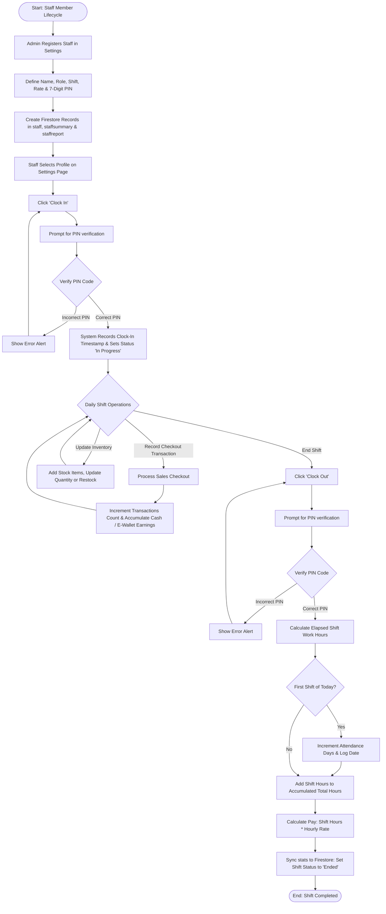

# Staff Flow Activity Diagram

This diagram describes the lifecycle of a staff member's shift from registration to clock-out, detailing PIN verifications, live sales transactions, inventory management, and automated payroll calculations.

## Activity Diagram - Mermaid Code

## Description of Key Stages

1. **Staff Registration:**
   - Managed by the system administrator under the **Staff Accounts** tab in Settings.
   - Staff credentials (including hourly rates and verification PINs) are initialized.
   - Creates three distinct records in Firestore: `staff` (identity), `staffsummary` (sales performance), and `staffreport` (attendance & payroll).

2. **Shift Clock-In Flow:**
   - Staff logs in via their user role and goes to the Settings page.
   - Upon clicking **Clock In**, the system requires verification of their 7-digit PIN.
   - Validating the PIN updates their shift status to `"In Progress"` and records the `clockInTimestamp`.

3. **Daily Operations (Active Shift):**
   - **Sales Transaction:** Every checkout handled by the staff records their name and totals transaction counts as well as cash/e-wallet values.
   - **Stock Inventory:** Staff can add items, restock quantities, and manage low-stock thresholds.

4. **Shift Clock-Out Flow:**
   - Staff verifies their identity using the PIN.
   - The system calculates elapsed minutes since `clockInTimestamp` and logs it as a decimal work hour value.
   - Checks if they have clocked in previously today (to prevent duplicate attendance counts).
   - Multiplies elapsed hours by their base rate to calculate the day's earnings, increments total pay, and updates their shift status to `"Ended"`.
