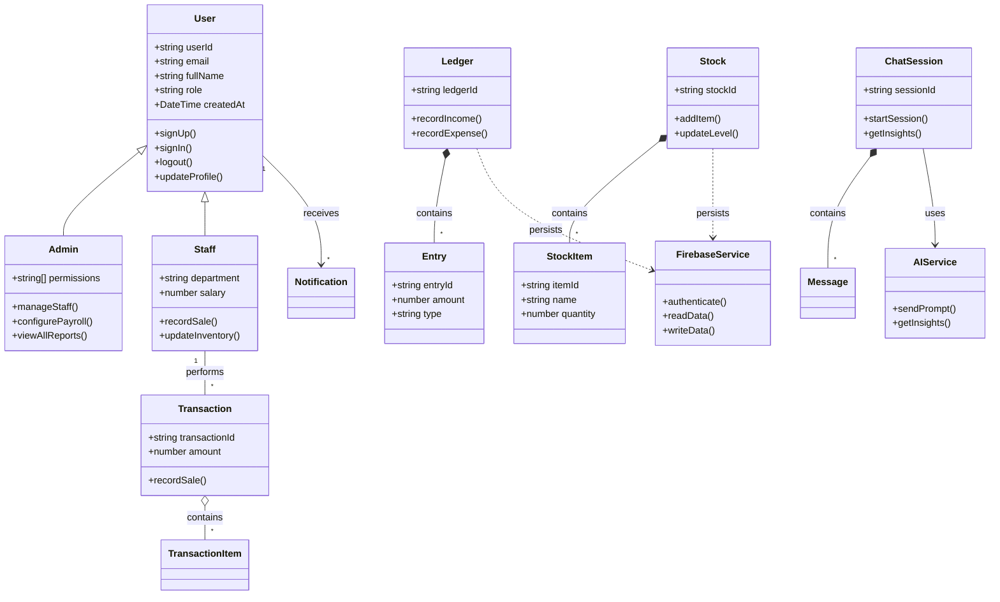

## Overview
This diagram represents the class structure and relationships of the Kedai business management system, including entities like User, Admin, Staff, Dashboard, Ledger, Stock, Transactions, Chat Sessions, and supporting services.

### Key Classes
- **User**: Base class for all users (Admin, Staff)
- **Admin**: Extended user with full system access
- **Staff**: Extended user with limited operations
- **Dashboard**: Financial overview and real-time metrics
- **Ledger**: Income/expense tracking and history
- **Stock**: Inventory management system
- **Transaction**: Sales transactions with items
- **ChatSession**: AI assistant interactions
- **PayrollRecord**: Salary and work hour management
- **FirebaseService**: Backend persistence and authentication

## Class Diagram - Mermaid Code

    ## Key Features

### Class Hierarchy:
- **User** (Base Class) - Common attributes and methods
  - **Admin** - Administrative operations and configuration
  - **Staff** - Staff operations and sales
  
### Entity Classes:
1. **Dashboard** - Financial overview and earnings tracking
2. **Ledger & Entry** - Income/expense management
3. **Stock & StockItem** - Inventory management with categories
4. **Transaction & TransactionItem** - Sales transactions
5. **ChatSession & Message** - AI conversation history
6. **PayrollRecord** - Salary and hour tracking
7. **Notification** - System notifications

### Service Classes:
- **FirebaseService** - Main backend orchestrator
- **AuthService** - Authentication and authorization
- **FirestoreService** - Database operations
- **AIService** - Google Gemini integration

### Relationships:
- **Inheritance**: Admin and Staff extend User
- **Composition**: Classes contain multiple child entities (Ledger contains Entries, etc.)
- **Association**: Classes reference other classes (Dashboard displays Transactions, etc.)
