## Overview
This diagram represents the class structure, domain models, and relationships of the Kedai business management system. It details the TypeScript entity models, the React Context / Hook state layer, and their interactions with Firebase and Gemini AI services.

### Key Classes & Entities
- **AuthContext**: Manages Firebase User Authentication state and actions.
- **TypeScript Domain Entities**:
  - **StaffMember**: Handles staff details, credentials, shifts, and attendance/payroll reporting.
  - **StockItem**: Handles product/inventory tracking and low-stock limits.
  - **SalesTransaction**: Represents checkout transactions and payment summaries.
  - **Expense**: Represents ledger entries for income/expense tracking.
  - **ChatSession & Message**: Formats conversation trees for the Akira AI Assistant.
- **React Hook Data Providers**:
  - **useStaffFirestore**: Aggregates core staff data, summaries, and reports.
  - **useStockFirestore**: Coordinates inventory updates and real-time stock sync.
  - **useTransactionsFirestore**: Manages transaction history.
  - **useExpensesFirestore**: Coordinates financial ledger entries.
  - **useChatSessionsFirestore**: Manages conversational AI state.

---

## Class Diagram - Mermaid Code

```mermaid
classDiagram
    class AuthContext {
        +user: FirebaseUser | null
        +loading: boolean
        +signUp(email: string, password: string) Promise
        +signIn(email: string, password: string) Promise
        +logout() Promise
    }

    class StaffMember {
        +id: string | number
        +name: string
        +email: string
        +role: string
        +joinDate: string
        +phone: string
        +clockInPin: string
        +pin: string
        +ic: string
        +shift: string
        +rate: string
        +timestamp: number
        +attendanceDays: number
        +hoursWorked: number
        +totalPay: number
        +shiftStatus: string
        +clockInTime: string
        +clockOutTime: string
        +workHours: number
        +clockInTimestamp: number
        +lastAttendanceDate: string
        +status: string
        +cashEarned: number
        +ewalletEarned: number
        +totalTransaction: number
        +totalEarned: number
    }

    class StockItem {
        +id: string | number
        +name: string
        +emoji: string
        +category: string
        +lastRecordedDate: string
        +totalInitial: number
        +used: number
        +lowStockThreshold: number
        +unit: string
    }

    class SalesTransaction {
        +id: string | number
        +date: string
        +time: string
        +orderId: string
        +staffName: string
        +staffInitials: string
        +staffColor: string
        +amount: number
        +paymentMethod: string
        +timestamp: number
    }

    class Expense {
        +id: string | number
        +description: string
        +subtext: string
        +category: string
        +amount: number
        +date: string
        +staff: string[]
        +type: string
        +timestamp: number
    }

    class ChatSession {
        +id: string
        +userId: string
        +title: string
        +createdAt: any
        +updatedAt: any
        +messages: Message[]
    }

    class Message {
        +id: string
        +sender: string
        +text: string
        +category: string
        +title: string
        +metrics: Metric[]
        +actions: Action[]
    }

    class Metric {
        +label: string
        +value: string
        +colorClass: string
    }

    class Action {
        +label: string
        +icon: string
        +variant: string
    }

    class useStaffFirestore {
        +staff: StaffMember[]
        +loading: boolean
        +error: string | null
        +addStaff(staffData: any) Promise
        +updateStaff(staffId: string, staffData: any) Promise
        +deleteStaff(staffId: string) Promise
    }

    class useStockFirestore {
        +stockList: StockItem[]
        +loading: boolean
        +error: Error | null
        +lastUpdatedTime: string
        +lastUpdatedBy: string
        +addItem(item: Omit, by: string) Promise
        +restockItem(itemId: string|number, amount: number, by: string) Promise
        +updateItemDetails(itemId: string|number, updatedFields: Partial, by: string) Promise
        +deleteItem(itemId: string|number, by: string) Promise
        +seedFallbackData(fallbackItems: StockItem[]) Promise
    }

    class useTransactionsFirestore {
        +transactions: SalesTransaction[]
        +loading: boolean
        +error: string | null
        +addTransaction(tx: Omit) Promise
        +deleteTransaction(id: string|number) Promise
    }

    class useExpensesFirestore {
        +expenses: Expense[]
        +loading: boolean
        +error: string | null
        +addExpense(expense: Omit) Promise
        +deleteExpense(id: string|number) Promise
    }

    class useChatSessionsFirestore {
        +chatSessions: ChatSession[]
        +loading: boolean
        +error: string | null
        +createChatSession(title: string, initialMessages: Message[]) Promise
        +updateChatSessionMessages(sessionId: string, messages: Message[], newTitle: string) Promise
        +deleteChatSession(sessionId: string) Promise
    }

    class FirebaseService {
        <<external>>
        +Auth: FirebaseAuth
        +Firestore: FirebaseFirestore
    }

    class GeminiAIService {
        <<external>>
        +generateContent()
    }

    %% Relationships
    AuthContext "1" --> "1" FirebaseService : authenticates via
    useStaffFirestore "1" --> "*" StaffMember : aggregates & supplies
    useStockFirestore "1" --> "*" StockItem : manages
    useTransactionsFirestore "1" --> "*" SalesTransaction : manages
    useExpensesFirestore "1" --> "*" Expense : manages
    useChatSessionsFirestore "1" --> "*" ChatSession : manages
    ChatSession "1" --> "*" Message : contains
    Message "1" --> "*" Metric : displays
    Message "1" --> "*" Action : offers
    
    useStaffFirestore ..> FirebaseService : persists to
    useStockFirestore ..> FirebaseService : persists to
    useTransactionsFirestore ..> FirebaseService : persists to
    useExpensesFirestore ..> FirebaseService : persists to
    useChatSessionsFirestore ..> FirebaseService : persists to
    useChatSessionsFirestore ..> GeminiAIService : communicates with
```

---

## Architectural & Model Features

### Authentication & Sessions:
- **AuthContext** relies directly on Firebase Auth and manages session boundaries.
- **useChatSessionsFirestore** isolates sessions by matching `userId` to the currently logged in user's ID.

### Staff & Attendance Schema:
- **useStaffFirestore** maps Firestore data from three collections: `staff` (identity), `staffsummary` (live check-ins, sales/revenue performance), and `staffreport` (attendance & pay totals).

### Ledger (Expenses):
- **useExpensesFirestore** queries transactions under the type `income` or `expense` to calculate live metrics.

### Stock & Inventory:
- **useStockFirestore** uses atomic increments (`increment`) to prevent race conditions during restocks and updates metadata in `metadata/stock_status`.

