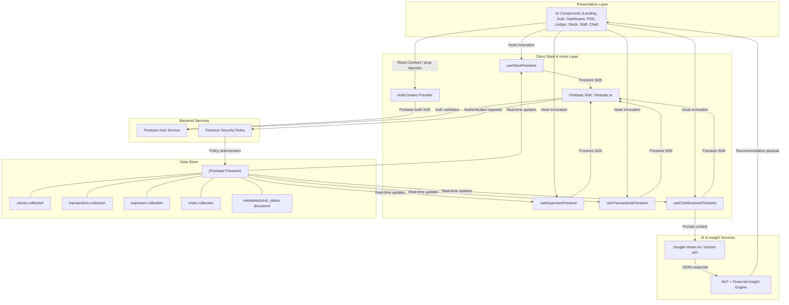

# Kedai System Architecture & Data Flow

This diagram illustrates the high-level architecture of the Kedai business management system, detailing the interactions between the client-side application, React hooks, Firebase backend, and the Google Gemini AI engine.

    ---

## Component Analysis & Data Flows

### 1. Unified Authentication Flow
*   The `AuthContext` component hooks into Firebase's `onAuthStateChanged` handler, wrapping the entire app in `App.tsx`.
*   Restricts routing so unauthenticated users land on `/` (Landing) or `/login` / `/register`.
*   Passes active session payloads to secure Firestore hooks.

### 2. Double-Branched Inventory (Stock) Flow
*   `Stock.tsx` acts as a role-based router interface.
*   **Administrators** are presented with `AdminStockView.tsx`, enabling deep item editing, removal, and seed-loading operations.
*   **Staff members** are restricted to `StaffStockView.tsx` which optimizes workflow speed with simplified adjustment controls (quick restocks, one-tap increments).
*   Both modules consume real-time reactive streams provided by `useStockFirestore.ts`, reading from the `'stocks'` collection and publishing updates directly to the `'metadata/stock_status'` document.

### 3. Point-of-Sale (POS) & General Ledger Integration
*   The `Menu.tsx` component houses local checkout states, communicating transactions to `useTransactionsFirestore.ts`.
*   Every processed checkout triggers real-time writes into Firestore's `'transactions'` collection.
*   Simultaneously, expense registrations and reports in `Ledger.tsx` write into the `'expenses'` collection.
*   These collections directly feed real-time aggregated metrics to `Dashboard.tsx` dynamically.

### 4. Natural Language Intelligence Engine
*   `AIAssistant.tsx` (the Akira AI companion) coordinates user inputs with Google Cloud Vertex AI endpoints (or Google Gen AI SDK) using the `@google/genai` interface.
*   Provides contextual inputs by fetching current financial structures (such as transactions and expenses streams) to allow real-time calculations, anomalies detection, and smart balance tracking.
*   Historical logs of chats are safely archived under the `'chats'` collection (`useChatSessionsFirestore.ts`) per logged-in user.
