# Kedai System Architecture & Data Flow

This diagram illustrates the high-level architecture of the Kedai business management system, detailing the interactions between the client-side presentation layer, the React state and hooks provider layer, the Firebase backend, and the Google Gemini AI engine.

```mermaid
graph TB
    subgraph Presentation["Presentation Layer"]
        UI["UI Pages (Landing, SignIn, SignUp, Dashboard, Menu/POS, Ledger, Stock, Staff, Settings, AIAssistant)"]
    end
    
    subgraph StateLogic["Client State & Hook Layer"]
        AuthCtx["AuthContext Provider"]
        StockHook["useStockFirestore"]
        ExpenseHook["useExpensesFirestore"]
        TxHook["useTransactionsFirestore"]
        ChatHook["useChatSessionsFirestore"]
        StaffHook["useStaffFirestore"]
        StaffRepHook["useStaffReportFirestore"]
        StaffSumHook["useStaffSummaryFirestore"]
        SalesSumHook["useSalesSummaryFirestore"]
        FirebaseSDK["Firebase SDK / firebase.ts"]
    end

    subgraph Backend["Backend Services"]
        FirebaseAuth["Firebase Auth Service"]
        FirestoreRules["Firestore Security Rules"]
    end

    subgraph AI["AI & Insight Services"]
        GeminiAPI["Google Gemini API"]
    end

    subgraph DataStore["Data Store"]
        Firestore["(Firebase Firestore)"]
        Stocks["stocks collection"]
        Transactions["transactions collection"]
        Expenses["expenses collection"]
        ChatSessions["chatSessions collection"]
        Staff["staff collection"]
        StaffSummary["staffsummary collection"]
        StaffReport["staffreport collection"]
        SalesSummary["sales_summary collection"]
        Metadata["metadata/stock_status document"]
    end

    UI -->|React Context| AuthCtx
    UI -->|Hook invocation| StockHook
    UI -->|Hook invocation| ExpenseHook
    UI -->|Hook invocation| TxHook
    UI -->|Hook invocation| ChatHook
    UI -->|Hook invocation| StaffHook
    UI -->|Hook invocation| SalesSumHook

    StaffHook -->|Combines Sub-Hooks| StaffRepHook
    StaffHook -->|Combines Sub-Hooks| StaffSumHook

    AuthCtx -->|Firebase Auth SDK| FirebaseAuth
    StockHook -->|Firestore SDK| FirebaseSDK
    ExpenseHook -->|Firestore SDK| FirebaseSDK
    TxHook -->|Firestore SDK| FirebaseSDK
    ChatHook -->|Firestore SDK| FirebaseSDK
    StaffHook -->|Firestore SDK| FirebaseSDK
    SalesSumHook -->|Firestore SDK| FirebaseSDK

    FirebaseSDK -->|Authenticated requests| FirestoreRules
    FirebaseSDK -->|Auth validation| FirebaseAuth
    FirestoreRules -->|Policy enforcement| Firestore

    ChatHook -->|Context & Chat History| GeminiAPI
    GeminiAPI -->|AI Response Payload| UI

    Firestore -->|Real-time streams| StockHook
    Firestore -->|Real-time streams| ExpenseHook
    Firestore -->|Real-time streams| TxHook
    Firestore -->|Real-time streams| ChatHook
    Firestore -->|Real-time streams| StaffHook
    Firestore -->|Real-time streams| SalesSumHook

    Firestore --- Stocks
    Firestore --- Transactions
    Firestore --- Expenses
    Firestore --- ChatSessions
    Firestore --- Staff
    Firestore --- StaffSummary
    Firestore --- StaffReport
    Firestore --- SalesSummary
    Firestore --- Metadata
```

---

## Component Analysis & Data Flows

### 1. Unified Authentication Flow
*   The `AuthContext` provider hooks into Firebase's `onAuthStateChanged` handler, wrapping the entire app inside `App.tsx`.
*   Restricts routes so unauthenticated users land on `/` (Landing), `/signin`, or `/signup`.
*   Passes active session payloads to secure views and hooks.

### 2. Double-Branched Inventory (Stock) Flow
*   `Stock.tsx` acts as a role-based router interface.
*   **Administrators** are presented with `AdminStockView.tsx`, enabling deep item editing, removal, and seed-loading operations.
*   **Staff members** are restricted to `StaffStockView.tsx` which optimizes workflow speed with simplified adjustment controls (quick restocks, one-tap increments).
*   Both modules consume real-time reactive streams provided by `useStockFirestore.ts`, reading from the `'stocks'` collection and publishing updates directly to the `'metadata/stock_status'` document.

### 3. Point-of-Sale (POS) & General Ledger Integration
*   The `Menu.tsx` component houses local checkout states, communicating transactions to `useTransactionsFirestore.ts`.
*   Every processed checkout triggers real-time writes into Firestore's `'transactions'` collection.
*   Expense registrations and reports in `Ledger.tsx` write into the `'expenses'` collection.
*   `useSalesSummaryFirestore.ts` manages expected cash, starting cash, gross margins, and actual collected sums in the `'sales_summary'` collection.

### 4. Staff Shifts & Payroll Aggregation
*   `useStaffFirestore.ts` handles the staff data feed by combining three sub-collections:
    1.  `'staff'`: Stores core metadata (Identity, Rate, PIN, Shift).
    2.  `'staffsummary'`: Captures today's shift details (Clock-In Time, Cash/E-Wallet Performance).
    3.  `'staffreport'`: Documents cumulative performance metrics (Hours Worked, Attendance Days, Total Earned).

### 5. Natural Language Intelligence Engine
*   `AIAssistant.tsx` (the Akira AI companion) coordinates user inputs with the Google Gemini API.
*   Provides contextual prompts by fetching current financial structures (such as transactions, ledger inputs, and stock levels) to allow real-time forecasting, anomaly detection, and smart balance tracking.
*   Historical logs of chats are archived under the `'chatSessions'` collection (`useChatSessionsFirestore.ts`) partitioned per logged-in user.

