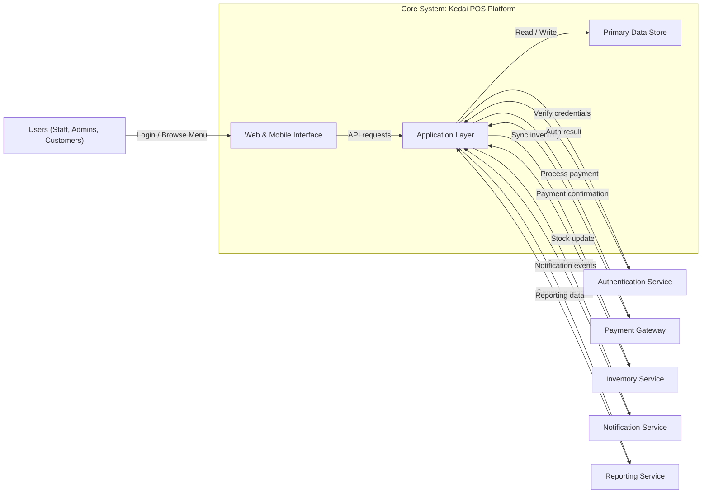

### Conceptual Architecture Diagram

This Mermaid diagram is formatted to be compatible with draw.io's Mermaid import and still shows the core Kedai POS platform, external entities, and their main interactions.
