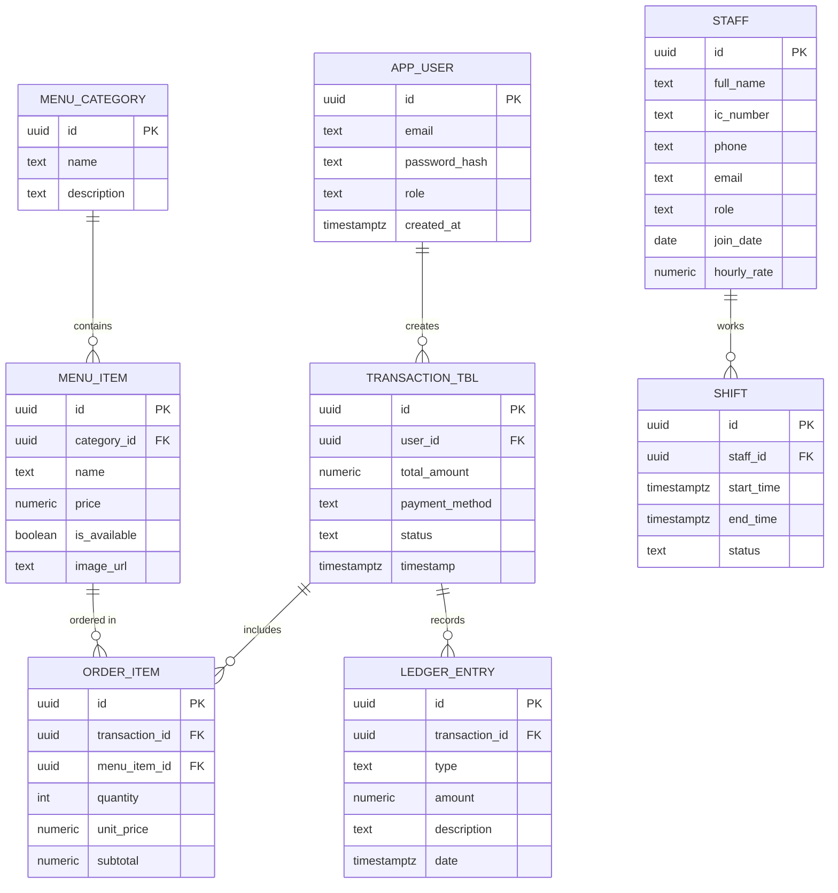

# Normalized ER Diagram and Schema

This file contains the normalized ER diagram (Mermaid) for the app and a compact Postgres schema.

## Mermaid ER Diagram



## Compact Postgres Schema (recommended)

```sql
-- Enable extension if needed:
-- CREATE EXTENSION IF NOT EXISTS pgcrypto;

CREATE TABLE app_user (
  id uuid PRIMARY KEY DEFAULT gen_random_uuid(),
  email text NOT NULL UNIQUE,
  password_hash text NOT NULL,
  role text NOT NULL,
  created_at timestamptz NOT NULL DEFAULT now()
);

CREATE TABLE menu_category (
  id uuid PRIMARY KEY DEFAULT gen_random_uuid(),
  name text NOT NULL,
  description text
);

CREATE TABLE menu_item (
  id uuid PRIMARY KEY DEFAULT gen_random_uuid(),
  category_id uuid REFERENCES menu_category(id) ON DELETE SET NULL,
  name text NOT NULL,
  price numeric(10,2) NOT NULL,
  is_available boolean NOT NULL DEFAULT true,
  image_url text
);

CREATE TABLE transaction_tbl (
  id uuid PRIMARY KEY DEFAULT gen_random_uuid(),
  user_id uuid REFERENCES app_user(id) ON DELETE SET NULL,
  total_amount numeric(12,2) NOT NULL,
  payment_method text,
  status text,
  timestamp timestamptz NOT NULL DEFAULT now()
);

CREATE TABLE order_item (
  id uuid PRIMARY KEY DEFAULT gen_random_uuid(),
  transaction_id uuid REFERENCES transaction_tbl(id) ON DELETE CASCADE,
  menu_item_id uuid REFERENCES menu_item(id),
  quantity integer NOT NULL CHECK (quantity > 0),
  unit_price numeric(10,2) NOT NULL,
  subtotal numeric(12,2) GENERATED ALWAYS AS (quantity * unit_price) STORED
);

CREATE TABLE ledger_entry (
  id uuid PRIMARY KEY DEFAULT gen_random_uuid(),
  transaction_id uuid REFERENCES transaction_tbl(id) ON DELETE SET NULL,
  type text NOT NULL,
  amount numeric(12,2) NOT NULL,
  description text,
  date timestamptz NOT NULL DEFAULT now()
);

CREATE TABLE staff (
  id uuid PRIMARY KEY DEFAULT gen_random_uuid(),
  full_name text NOT NULL,
  ic_number text,
  phone text,
  email text,
  role text,
  join_date date,
  hourly_rate numeric(10,2)
);

CREATE TABLE shift (
  id uuid PRIMARY KEY DEFAULT gen_random_uuid(),
  staff_id uuid REFERENCES staff(id) ON DELETE CASCADE,
  start_time timestamptz,
  end_time timestamptz,
  status text
);

-- Indexes
CREATE INDEX idx_menu_item_category ON menu_item(category_id);
CREATE INDEX idx_transaction_user ON transaction_tbl(user_id);
CREATE INDEX idx_order_item_transaction ON order_item(transaction_id);
CREATE INDEX idx_ledger_transaction ON ledger_entry(transaction_id);
CREATE INDEX idx_shift_staff ON shift(staff_id);
```

---
If you'd like, I can also export this diagram as PNG/SVG or add the SQL to a migration file.
