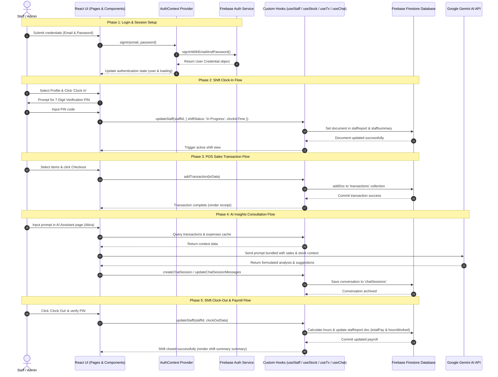

```mermaid
sequenceDiagram
    autonumber
    actor User as Staff / Admin
    participant UI as React UI (Pages & Components)
    participant AuthCtx as AuthContext Provider
    participant Auth as Firebase Auth Service
    participant Hooks as Custom Hooks (useStaff / useStock / useTx / useChat)
    participant Firestore as Firebase Firestore Database
    participant Gemini as Google Gemini AI API

    %% Phase 1: Authentication
    Note over User, Auth: Phase 1: Login & Session Setup
    User->>UI: Submit credentials (Email & Password)
    UI->>AuthCtx: signIn(email, password)
    AuthCtx->>Auth: signInWithEmailAndPassword()
    Auth-->>AuthCtx: Return User Credential object
    AuthCtx-->>UI: Update authentication state (user & loading)
    
    %% Phase 2: Clock-In Verification
    Note over User, Firestore: Phase 2: Shift Clock-In Flow
    User->>UI: Select Profile & Click 'Clock In'
    UI->>User: Prompt for 7-Digit Verification PIN
    User->>UI: Input PIN code
    UI->>Hooks: updateStaff(staffId, { shiftStatus: 'In Progress', clockInTime })
    Hooks->>Firestore: Set document in staffreport & staffsummary
    Firestore-->>Hooks: Document updated successfully
    Hooks-->>UI: Trigger active shift view

    %% Phase 3: Sales Checkout Transaction
    Note over User, Firestore: Phase 3: POS Sales Transaction Flow
    User->>UI: Select items & click Checkout
    UI->>Hooks: addTransaction(txData)
    Hooks->>Firestore: addDoc to 'transactions' collection
    Firestore-->>Hooks: Commit transaction success
    Hooks-->>UI: Transaction complete (render receipt)

    %% Phase 4: Akira AI Assistant Consultation
    Note over User, Gemini: Phase 4: AI Insights Consultation Flow
    User->>UI: Input prompt in AI Assistant page (Akira)
    UI->>Hooks: Query transactions & expenses cache
    Hooks-->>UI: Return context data
    UI->>Gemini: Send prompt bundled with sales & stock context
    Gemini-->>UI: Return formulated analysis & suggestions
    UI->>Hooks: createChatSession / updateChatSessionMessages
    Hooks->>Firestore: Save conversation to 'chatSessions'
    Firestore-->>Hooks: Conversation archived

    %% Phase 5: Clock-Out & Payroll compilation
    Note over User, Firestore: Phase 5: Shift Clock-Out & Payroll Flow
    User->>UI: Click 'Clock Out' & verify PIN
    UI->>Hooks: updateStaff(staffId, clockOutData)
    Hooks->>Firestore: Calculate hours & update staffreport doc (totalPay & hoursWorked)
    Firestore-->>Hooks: Commit updated payroll
    Hooks-->>UI: Shift closed successfully (render shift summary summary)
```

