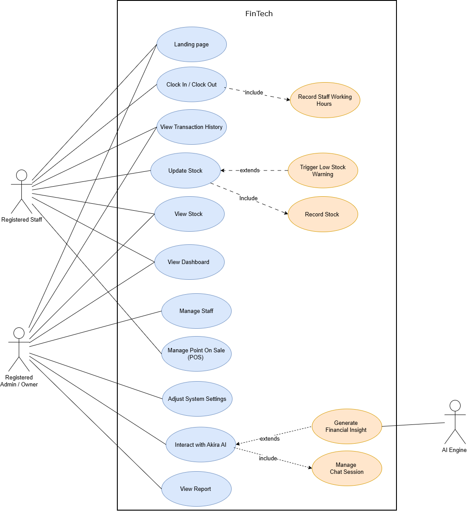

<div align="center">

</div>

# FinTech SME POS & Staff Management System

A sleek, modern finance and staff operations portal designed specifically for Malaysian Hawkers and SMEs. Streamline transactions, manage real-time staff clock-in/out schedules, track attendance, and generate business insight reports powered by Google Gemini.

---

## 🚀 Getting Started

### 📋 Prerequisites

Before setting up and running the application, make sure you have the following installed on your local machine:

* **Node.js**: `v18.0.0` or higher (LTS recommended)
* **npm**: `v9.0.0` or higher (bundled with Node.js)
* **Git**: To clone the repository and manage revisions

---

## 🛠️ Local Installation

Follow these step-by-step instructions to get a local development copy running on your machine:

### 1. Clone the Repository
Clone the repository using Git and navigate to the project directory:
```bash
git clone https://github.com/nloqmanhn05/Kedai1.0.git
cd Kedai
```

### 2. Install Project Dependencies
Use npm to download and build all required libraries and assets:
```bash
npm install
```

### 3. Environment Variable Configuration
Create a local environment configuration file. The app integrates Google Gemini API and Firebase databases to track staff hours and metrics.

Copy or create a `.env.local` file in the root directory:
```bash
touch .env.local
```

Add your Gemini API Key to the configuration:
```env
VITE_GEMINI_API_KEY=your_gemini_api_key_here
```

### 4. Running the Development Server
Launch the local development server:
```bash
npm run dev
```

* The terminal will print out the local network address (typically `http://localhost:5173`).
* Open your browser and navigate to this URL to view the live app.

---

## 🏗️ Production Build

To generate an optimized bundle ready for hosting/deployment, compile the application using the following build script:

```bash
npm run build
```

This compiles static assets into the `dist/` directory, which can be deployed to static hosting providers like Firebase Hosting, Vercel, or Netlify.

---

## 📱 Features Spotlight
* **Unified Sales Ledger**: Consolidate Cash, DuitNow, and digital payments into a single reconcilable dashboard.
* **Smart Attendance Tracking**: Prevent duplicate logs with date-based attendance tracking (increments only once per day).
* **Automated Payroll**: Auto-calculate accumulated working hours, overtime multipliers, and monthly payout statistics.
* **Akira AI Assistant**: Google Gemini-powered chat assistant providing predictions and optimization recommendations for your stall.
